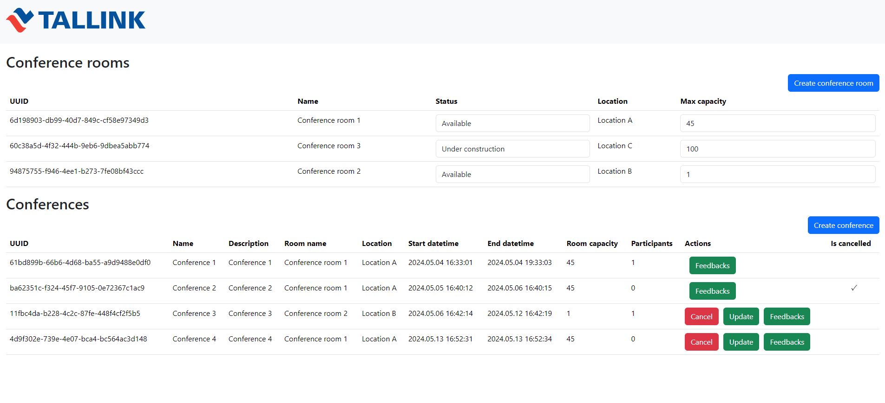
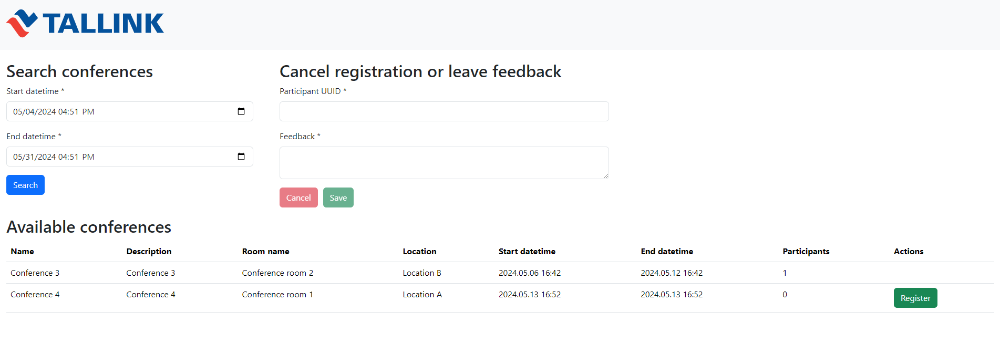

# Demo of Spring application with Angular, Flyway, PostgreSQL




Easiest way to run:
 - 1. Install Docker
 - 2. From project's root folder run command:
 ```
 docker compose up
 ```
 It will create container and images for backend, frontend
 - 3. Navigating to http://localhost:4200 will open Angular app
 - 4. Navigate to http://localhost:4200/backoffice for creating rooms and conferences
 - 5. Navigate to http://localhost:4200/conference for searching available conferences and leave feedbacks
